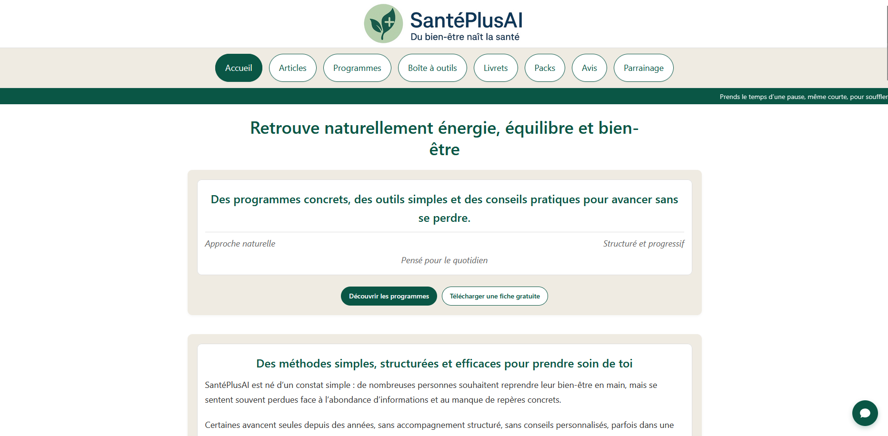

<p align="center">
  
</p>

> 🇬🇧 English | [🇫🇷 Français](./README_FR.md)


<p align="center">
  <a href="https://santeplusai.fr">
    
  </a>
</p>

> This repository is a technical presentation and documentation repository.  
> It does not contain downloadable source code or production files.

# Project Overview

This repository presents the complete architecture of a website focused on natural wellness,  
designed without CMS, SaaS, cookies, or an exposed application backend.

The entire system runs exclusively on shared hosting,  
without dedicated infrastructure or managed services,  
except for the payment provider.

The project follows a deliberately minimalist and autonomous approach:  
no critical external dependencies, no data collection, and an infrastructure  
designed to operate sustainably on shared hosting.

Due to shared hosting constraints,  
server entry points may be physically located  
within the site layer while remaining  
strictly protected by server-level access rules.

The separation presented in this repository is logical and functional.  
It does not necessarily reflect the exact physical deployment,  
which may vary depending on hosting constraints.

The website is currently deployed in production at https://santeplusai.fr

---

## Principles and Goals

The project was designed around clear principles:  

- total autonomy of the infrastructure  
- no unnecessary third-party services  
- no reliance on CMS or server frameworks  
- no user data collection  
- long-term stability and maintainability  
- attack surface minimized to the bare minimum

The goal was not to maximize technical complexity, but to build a robust, readable,  
and predictable system capable of functioning reliably without constant supervision.

---

## General Architecture

The project is structured around three distinct subsystems, deliberately separated by role and exposure level.
This organization helps minimize the attack surface, clarify responsibilities, and ensure simple long-term maintenance.

The architecture is based on the following blocks:  

- `site/`: public static site, including protected server entry points  
- `web/`: minimal exposed technical layer (server entry point, access rules)  
- `worker/`: asynchronous internal processing (bot, automation, maintenance)

Each subsystem is logically independent but interacts in a controlled manner with the others.

---

## Project Structure

```
santeplusai/
├── docs/
│    ├── README.md                      → General overview of the project and its architecture
│    ├── OPERATIONS.md                  → Operations and usage guide
│    └── SYSTEM_OVERVIEW_FR.md          → System overview
│ 
├── LICENSE.md                          → Terms of use and legal Framework
│
├── worker/
│    ├── main.py                        → Worker entry point (cron / PHP trigger)
│    ├── core.py                        → Main worker logic
│    ├── task_a.py                      → Automated response processing
│    ├── task_b.py                      → Log maintenance task
│    ├── bridge.php                     → PHP → Python bridge
│    ├── config.json                    → Configuration file (anonymized)
│    ├── state_a.json                   → Processed identifiers registry
│    ├── cron_log.txt                   → Cron execution output
│    │
│    ├── data/
│    │   └── data_a.json                → Worker data source
│    │
│    ├── logs/
│    │   └── unmatched.txt              → Unmatched entries log
│    │
│    └── tmp/
│        └── state.txt                  → Runtime control / state file
│
├── web/
│    ├── state.txt                      → System control / state file
│    └── .htaccess                      → Access and security rules
│
└── site/
     │
     ├── pdf/
     │    ├── .htaccess                 → Internal access rules
     │    ├── dompdf/                   → PDF generation library
     │    ├── processed_stripe_ids.json → Stripe payment deduplication
     │    ├── template_invoice.html     → Invoice HTML template
     │    ├── invoices/                 → Generated invoices
     │    ├── recettes/                 → Revenue data
     │    ├── success.html              → Page shown after successful payment
     │    ├── cancel.html               → Page shown after canceled payment
     │    ├── counter.json              → Invoice numbering counter
     │    ├── get_counter.php           → Next invoice number generation
     │    ├── lib_pdf.php               → PDF generation functions
     │    ├── lib_html.php              → HTML utility functions
     │    ├── lib_mail.php              → Automated invoice email delivery
     │    └── lib_counter.php           → Invoice counter functions
     │
     ├── assets/
     │    └── css/                      → Stylesheets (external optional)
     │
     ├── images/                        → Site images (logos and favicons included)
     │    └── site.webmanifest          → Site web manifest
     │
     ├── pages/                         → HTML pages (articles and content)
     │    └── *.html
     │
     ├── logs/
     │    ├── .htaccess                 → Internal access rules
     │    └──  errors.txt               → Error log
     │
     ├── tmp/state.txt                  → Control / state file
     │
     ├── dl/                            → Store
     │
     ├── index.html                     → Home page
     ├── data_b.json                    → Review submission log
     ├── task_a.py                      → Log cleanup script
     │
     ├── .htaccess                      → Main access rules
     ├── endpoint_a.php                 → Stripe payment webhook
     ├── endpoint_b.php                 → Review submission handler
     ├── endpoint_c.php                 → Secure download endpoint 
     ├── endpoint_d.php                 → Stripe checkout initializer
     ├── robots.txt                     → Search engine indexing rules
     ├── sitemap.xml                    → Sitemap for indexing
     ├── data_a.json                    → Temporary download tokens
     ├── index_hero.js                  → Weekly content initialization script
     ├── weekly-2025                    → Weekly data – year 2025
     └── weekly-2026                    → Weekly data – year 2026
```


---

### `site/` — Public Layer

This folder contains exclusively the public site: https://santeplusai.fr

It is a static website composed of independent HTML files, accompanied by lightweight CSS stylesheets and JavaScript scripts.  
No critical server-side logic is exposed from this layer.

The public site is the only point of contact with the browser.  
It does not store any sensitive data and does not depend on any external services.

Although certain server-side scripts are physically located within this directory,  
they are never directly accessible and are strictly protected by server-level rules.

---

### `web/` — Minimal Exposed Technical Layer

This folder corresponds to the exposed server entry point  
(`public_html` in the production environment).

It intentionally contains no business logic  
and is strictly limited to:  

- server access control rules (`.htaccess`)  
- technical state or restart files

No functional processing, no business data,  
and no application scripts are present in this layer.

This separation helps reduce the attack surface  
and strictly isolate the public site from sensitive processing.

---

### `worker/` — Internal Automation

The `worker/` folder contains internal processes that run in the background, with no public exposure.  
These scripts are triggered solely via scheduled tasks or internal server calls.

They handle, among other things:  

- automation of specific operations  
- log maintenance  
- temporary file cleanup  
- management of locally stored internal data

This choice eliminates the need for an exposed backend and maintains a silent, controlled architecture.

---

## 1. Static Public Site

The public site is built on a deliberately simple and lightweight architecture,  
entirely composed of independent HTML files.  
No CMS, no frameworks, no builders, and no CDNs are used.  
Each page is designed as an autonomous, stable, and reusable unit.

### Key Features

- Fully static site (HTML + standalone CSS)  
- No critical external dependencies  
- Fast and smooth navigation  
- Design focused on visual comfort  
- Simple and predictable structure  
- Exportable and reusable files without adaptation

This choice ensures a fast, robust, and easy-to-maintain site,  
with an extremely reduced risk of failure.

The site also includes lightweight dynamic display scripts,  
allowing certain content to evolve periodically without any backend or client-side storage.

Stylesheets can be integrated autonomously or optionally externalized,  
with no critical dependency on external loading.

---

## 2. Internal Automation (Worker)

The project incorporates an internal automation system, without exposing any application backend to the public.
No Python server is accessible from the outside (no web framework,  
no public APIs, no persistent runtime). All processes are executed exclusively internally.

### How It Works

- Python scripts executed via scheduled tasks (Cron)  
- Controlled triggers from the server  
- Data stored locally in JSON format  
- No unnecessary outgoing communication  
- No direct network exposure

This choice allows for a silent, controlled, and compliant architecture,  
while ensuring the project’s automation and maintenance needs are met.  
The absence of an exposed backend significantly reduces the attack surface and simplifies long-term monitoring.

---

## 2 bis. Internal Assistant and Response Engine

The project integrates an internal assistant designed to guide users and answer targeted questions,  
without exposing complex application logic on the public side.

This assistant relies on an autonomous response engine, implemented in Python and powered by a locally structured JSON database.  
It analyzes incoming queries, identifies keyword and category matches, and then returns tailored responses.

### How It Works

- Response engine executed server-side  
- Deterministic and controlled logic  
- No reliance on external AI services  
- No collection or storage of personal data  
- Local logging of unrecognized queries  
- Traceability of technical errors for maintenance purposes

The assistant does not provide medical advice and is strictly limited to informational and guiding content,  
in line with the project’s scope.  
This choice offers contextual assistance while maintaining a sober,  
predictable architecture that respects security and compliance constraints.

---

## 3. Payment, Invoicing, and Distribution

The project integrates a payment and distribution system fully managed server-side,  
without relying on any external automation intermediaries.
Payments are initiated via a dedicated provider and then processed by internal scripts triggered by events.  
No sensitive data is stored on the public site.

### General Pipeline

- Payment triggered via a dedicated page  
- Reception and processing of server events  
- Automatic generation of invoices in PDF format  
- Assignment of a unique, sequential invoice number  
- Automatic filing of documents by year and month  
- Preparation of secure download access

The entire process is automated and does not depend on any third-party orchestration platform.

### Secure File Distribution

The distribution of digital files relies on a dedicated internal engine,  
designed to avoid any direct exposure of resources.  
Files are never accessible via public URLs. Access is conditioned on temporary one-time use links,  
generated dynamically after server-side validation.

The implemented controls include, notably:  

- Automatic expiration of access  
- Validation of the download context  
- Access integrity checks  
- Immediate invalidation after use  
- Timestamped logging of actual accesses

The system also distinguishes between a simple link consultation and an actual download,  
with notifications sent to the administration side.
The entire mechanism works without third-party services and without exposing any sensitive logic on the public site.

---

## 4. Security and Structural Protection

The project’s security relies primarily on simple and strict structural choices rather than the accumulation of external solutions.  
The architecture has been deliberately designed to minimize the attack surface and reduce exploitable entry points.

### Implemented Measures

- Strict separation between the public site and server-side logic  
- Enhanced access rules at the server level  
- Complete deactivation of directory listing  
- Protection of sensitive files (data, scripts, logs)  
- Critical zones made inaccessible by default  
- No direct URLs to private resources

File names, endpoints, and sensitive data have been deliberately abstracted to limit opportunistic attacks and automated scanning.  
This approach prioritizes simplicity, readability, and long-term passive security.

---

## 5. GDPR Compliance and Data Minimization

The project was designed from the outset with a maximal data minimization approach and regulatory compliance in mind.  
No personal data is collected for tracking, analysis, or profiling purposes.  
The site does not rely on any tracking mechanisms.

### Applied Principles

- No cookies used  
- No third-party trackers or pixels  
- No external analytics tools  
- No local storage on the browser side  
- No user accounts  
- No data collection for marketing purposes

The only data handled by the system is strictly functional, time-limited, and stored locally on the server side.  
This approach ensures native GDPR compliance, without intrusive banners or consent management,  
while respecting the principle of data minimization.

---

## 6. Technical Choices and Sustainability

The technical choices made in this project were guided by the goal of sustainability rather than the pursuit of complexity or novelty.

The architecture does not rely on any server frameworks, persistent application runtimes, or heavy dependencies.  
The components used are deliberately simple, stable, and proven.

### Chosen Principles

- No CMS or server frameworks  
- No dependencies that need continuous maintenance  
- Use of simple, sustainable formats (HTML, JSON, Python)  
- Readable and auditable application logic  
- Compatibility with standard shared hosting environments

This choice drastically reduces maintenance needs, avoids disruptions from updates, and ensures maximum stability in the long term.  
The goal is not technical sophistication, but reliability, predictability, and full control over the system.

---

## Security Notes and Disclosure

This repository provides an accurate view of the project’s logical architecture while respecting responsible disclosure principles.  
Certain file names, endpoints, and structures have been deliberately abstracted or modified to limit any direct exploitation.  
No keys, secrets, real data, or sensitive production paths are present in this repository.  
The exposed structure aims to document technical choices and system organization, without reproducing the exact production environment.

---

## Communication and Automated Maintenance

The project integrates communication mechanisms that are intentionally limited and controlled.

Email notifications are used solely to confirm the receipt of messages or to notify of important technical events.  
User responses are handled manually, by choice, to preserve human interaction.

Additionally, internal scripts ensure automated maintenance:  

- Regular cleanup of temporary files  
- Purging of expired logs and data  
- Maintaining a clean and stable environment over time

---

## Conclusion

This project demonstrates the design of a complete, autonomous, and secure website,  
without relying on external platforms and without unnecessary backend exposure.

It shows that a simple, well-thought-out, and controlled architecture  
can meet real-world needs while remaining sustainable, performant, and compliant.

The system was designed to be reliable in the long term,  
requiring minimal maintenance and reducing the attack surface.

---

© Palks Studio — see LICENSE.md  
- https://palks-studio.com
