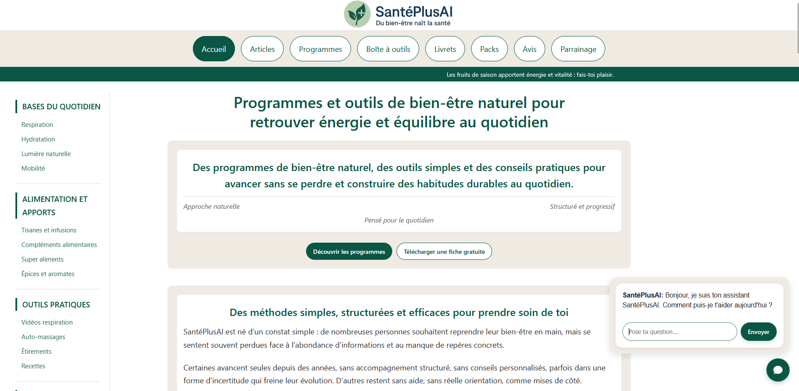

<p align="center">
  
</p>

> 🇫🇷 Français | [🇬🇧 English](./README.md)


<p align="center">
  <a href="https://santeplusai.fr">
    
  </a>
</p>

# Présentation du projet

> Ce dépôt constitue une présentation technique et une documentation du projet.  
> Il ne contient pas de code source téléchargeable ni de fichiers de production.

Ce dépôt présente l’architecture complète d’un site web orienté bien-être naturel,  
conçu sans CMS, sans SaaS, sans cookies et sans backend applicatif exposé.

L’ensemble du système fonctionne exclusivement sur un hébergement mutualisé,  
sans infrastructure dédiée ni services managés,  
à l’exception du prestataire de paiement.

Le projet repose sur une approche volontairement minimaliste et autonome :  
aucune dépendance critique externe, aucune collecte de données, et une
infrastructure pensée pour fonctionner durablement sur un hébergement mutualisé.

Selon les contraintes de l’hébergement mutualisé,  
les points d’entrée serveur peuvent être physiquement  
regroupés dans la couche site tout en restant  
strictement protégés par des règles serveur.

La séparation présentée dans ce dépôt est logique et fonctionnelle.  
Elle ne reflète pas nécessairement l’implantation physique exacte,  
qui peut varier selon les contraintes de l’hébergement de production.

Le site est aujourd’hui exploité en production sur https://santeplusai.fr.

---

## Principes et objectifs

Le projet a été conçu autour de principes clairs :  

- autonomie totale de l’infrastructure  
- absence de services tiers non indispensables  
- aucune dépendance à un CMS ou à un framework serveur  
- aucune collecte de données utilisateur  
- stabilité et maintenabilité sur le long terme  
- surface d’attaque réduite au strict minimum

L’objectif n’était pas de maximiser la complexité technique,  
mais de construire un système robuste, lisible et prévisible,  
capable de fonctionner de manière fiable sans supervision constante.

---

## Architecture générale

Le projet est structuré autour de trois sous-systèmes distincts,  
séparés volontairement par rôle et niveau d’exposition.

Cette organisation permet de limiter la surface d’attaque,  
de clarifier les responsabilités et de garantir une maintenance simple
sur le long terme.

L’architecture repose sur les blocs suivants :  

- `santeplusai.fr/` : site public statique, incluant des points d’entrée serveur protégés  
- `core/` : zone technique exposée minimale (point d’entrée serveur, règles d’accès)  
- `assistant-node/` : traitements internes asynchrones (bot, automatisation, maintenance)

Chaque sous-système est indépendant sur le plan logique,  
mais interagit de manière contrôlée avec les autres.

---

## Arborescence du projet

```
santeplusai/
├── core/
│    │
│    ├── data_counter.json             → Compteur de numérotation des factures
│    ├── data_tokens.json              → Jetons temporaires liés aux téléchargements
│    ├── data_config.json              → Fichier de configuration (anonymisé)
│    ├── logs_reviews.json             → Journal des soumissions d’avis
│    ├── engine_logs_cleaner.py        → Script de nettoyage des logs
│    ├── engine_reviews_cleaner.py     → Script de nettoyage des avis
│    ├── engine_emails_cleaner.py      → Script de nettoyage des mails
│    ├── data_senders.json             → Suivi des réponses automatiques e-mail
│    ├── data_stripe.json              → Anti-doublon Stripe
│    ├── engine_downloads_cleaner.php  → Nettoyage des logs de téléchargements
│    ├── engine_tokens_cleaner.php     → Nettoyage des jetons expirés
│    ├── core_counter.php              → Génération du prochain numéro de facture
│    ├── core_pdf.php                  → Fonctions de génération PDF
│    ├── core_html.php                 → Fonctions utilitaires HTML
│    ├── core_mail.php                 → Envoi automatique des factures par e-mail
│    ├── core_engine.php               → Fonctions liées au compteur
│    │
│    ├── renderer/                     → Librairie de génération de PDF
│    ├── invoices/                     → Factures générées
│    ├── revenues/                     → Données de recettes
│    ├── logs/                         → Journaux d’erreurs
│    └── docs/
│        ├── GUIDE_CORE.md             → Vue d’ensemble du projet et de son architecture
│        ├── SYSTEM.md                 → General overview of the project and its architecture
│        ├── OPERATIONS.md             → Guide d’exploitation et de fonctionnement
│        └── OVERVIEW.md               → Vue d’ensemble du système
│
├── assistant-node/
│    ├── engine_main.py                → Point d’entrée du worker (cron / déclencheur PHP)
│    ├── engine_core.py                → Logique principale du worker
│    ├── engine_reply.py               → Traitement automatisé
│    ├── engine_purge.py               → Maintenance des journaux
│    ├── bridge.php                    → Pont PHP → Python
│    ├── data/                         → Source de données du worker
│    └── tmp/                          → Fichier de contrôle / état
│
└── santeplusai.fr/
     ├── pdf/
     │    ├── template_document.html   → Modèle HTML de facture
     │    ├── success.html             → Page affichée après paiement réussi
     │    └── cancel.html              → Page affichée après paiement annulé
     │
     ├── assets/                       → Feuilles de style (externe optionnel)
     ├── pages/                        → Pages HTML du site (articles et contenus)
     ├── images/                       → Images du site (logos et favicons inclus)
     ├── tmp/                          → Fichier de contrôle / état
     ├── dl/                           → Store
     │
     ├── LICENCE.md                    → Conditions d’utilisation et cadre légal
     │
     ├── site.webmanifest              → Manifest PWA du site
     ├── index.html                    → Page d’accueil
     ├── gateway.php                   → Webhook de paiement Stripe
     ├── reviews.php                   → Gestionnaire d’envoi d’avis
     ├── download.php                  → Point d’entrée de téléchargement
     ├── checkout.php                  → Initialisation du paiement Stripe
     ├── robots.txt                    → Règles d’indexation pour les moteurs de recherche
     ├── sitemap.xml                   → Plan du site pour l’indexation
     ├── hero_loader.js                → Script d’initialisation du contenu hebdomadaire
     ├── messages-2025.js              → Données hebdomadaires – année 2025
     └── messages-2026.js              → Données hebdomadaires – année 2026
```


---

### `santeplusai.fr/` — site public statique, incluant des points d’entrée serveur protégés

Ce dossier contient exclusivement le site public : https://santeplusai.fr

Il s’agit d’un site statique composé de fichiers HTML indépendants,  
accompagnés de feuilles de style et de scripts JavaScript légers.  
Aucune logique serveur critique n’est exposée depuis cette couche.

Le site public est le seul point de contact avec le navigateur.  
Il ne stocke aucune donnée sensible et ne dépend d’aucun service externe.

---

### `core/` — zone technique exposée minimale

Ce dossier contient l'ensemble de la logique serveur privée :  
scripts de traitement, bibliothèques PHP, données JSON,  
factures générées et journaux internes.

Il n'est jamais exposé publiquement et n'est accessible  
qu'en interne, depuis les scripts et tâches planifiées.

---

### `assistant-node/` — traitements internes asynchrones

Le dossier `assistant-node/` contient exclusivement les traitements internes  
exécutés en arrière-plan.

Il correspond à la partie bot / assistant / automatisation Python  
du système et n’est jamais exposé publiquement.

Les scripts sont déclenchés uniquement via :  

- des tâches planifiées (Cron)  
- des appels serveur internes contrôlés

Aucun serveur Python, aucune API publique  
et aucun runtime persistant ne sont utilisés.

Ce choix permet de conserver une architecture silencieuse,  
maîtrisée et adaptée à un hébergement mutualisé.

---

## 1. Site public statique

Le site public repose sur une architecture volontairement simple et légère,  
entièrement composée de fichiers HTML indépendants.

Aucun CMS, aucun framework, aucun builder et aucun CDN ne sont utilisés.  
Chaque page est conçue comme une unité autonome, stable et réutilisable.

### Caractéristiques principales

- site entièrement statique (HTML + CSS autonome)  
- aucune dépendance externe critique  
- navigation rapide et fluide  
- thème pensé pour le confort visuel  
- structure simple et prévisible  
- fichiers exportables et réutilisables sans adaptation

Ce choix permet de garantir un site rapide, robuste et facile à maintenir,  
avec un risque de panne extrêmement réduit.

Le site intègre également des scripts légers d’affichage dynamique,  
permettant de faire évoluer certains contenus de manière périodique  
sans backend ni stockage côté client.

Les feuilles de style peuvent être intégrées de manière autonome  
ou externalisées de façon optionnelle,  
sans dépendance critique au chargement externe.

---

## 2. Automatisation interne (worker)

Le projet intègre un système d’automatisation interne,  
sans exposer de backend applicatif au public.

Aucun serveur Python n’est accessible depuis l’extérieur  
(pas de framework web, pas d’API publique, pas de runtime persistant).  
Les traitements sont exécutés exclusivement en interne.

### Fonctionnement

- scripts Python exécutés via des tâches planifiées (Cron)  
- déclenchements contrôlés depuis le serveur  
- données stockées localement au format JSON  
- aucune communication sortante non nécessaire  
- aucune exposition réseau directe

Ce choix permet de conserver une architecture silencieuse,  
maîtrisée et conforme, tout en assurant les besoins  
d’automatisation et de maintenance du projet.

L’absence de backend exposé réduit fortement la surface d’attaque  
et simplifie la supervision sur le long terme.

---

## 2 bis. Assistant interne et moteur de réponse

Le projet intègre un assistant interne destiné à orienter les utilisateurs  
et à répondre à des questions ciblées, sans exposer de logique applicative  
complexe côté public.

Cet assistant repose sur un moteur de réponse autonome,  
implémenté en Python et alimenté par une base de données locale  
structurée au format JSON.  
Il analyse les requêtes reçues, identifie des correspondances  
par mots-clés et catégories, puis renvoie des réponses adaptées.

Cet assistant est un composant optionnel, indépendant du pipeline de paiement,  
et n’est pas requis pour le fonctionnement transactionnel du système.

### Principes de fonctionnement

- moteur de réponse exécuté côté serveur  
- logique déterministe et maîtrisée  
- aucune dépendance à un service d’IA externe  
- aucune collecte ou conservation de données personnelles  
- journalisation locale des requêtes non reconnues  
- traçabilité des erreurs techniques à des fins de maintenance

L’assistant ne délivre aucun conseil médical  
et se limite strictement à des contenus informatifs et orientatifs,  
conformément au périmètre du projet.

Ce choix permet de proposer une aide contextualisée  
tout en conservant une architecture sobre,  
prévisible et respectueuse des contraintes de sécurité et de conformité.

---

## 3. Paiement, facturation et distribution

Le projet intègre un système de paiement et de distribution  
entièrement géré côté serveur, sans intermédiaire d’automatisation externe.

Le prestataire de paiement est utilisé exclusivement pour le traitement transactionnel,  
la logique de facturation et de distribution reste sous contrôle serveur.

### Pipeline général

- déclenchement du paiement via une page dédiée  
- réception et traitement des événements serveur  
- génération automatique des factures au format PDF  
- attribution d’un numéro de facture unique et séquentiel  
- classement automatique des documents par année et par mois  
- préparation des accès de téléchargement sécurisés

L’ensemble du processus est automatisé et ne dépend  
d’aucune plateforme tierce d’orchestration.

### Distribution sécurisée des fichiers

La distribution des fichiers numériques repose sur un moteur interne dédié,  
conçu pour éviter toute exposition directe des ressources.

Les fichiers ne sont jamais accessibles par URL publique.  
L’accès est conditionné à des liens temporaires à usage unique,  
générés dynamiquement après validation côté serveur.

Les contrôles mis en place incluent notamment :  

- expiration automatique des accès  
- validation du contexte de téléchargement  
- contrôle d’intégrité des accès  
- invalidation immédiate après usage  
- journalisation horodatée des accès effectifs

Le système permet également de distinguer  
une simple consultation de lien  
d’un téléchargement réellement effectué,  
avec notification côté administration.

L’ensemble du mécanisme fonctionne sans service tiers  
et sans exposition de logique sensible côté site public.

---

## 4. Sécurité et protection structurelle

La sécurité du projet repose avant tout sur des choix structurels  
simples et stricts, plutôt que sur l’empilement de solutions externes.

L’architecture a été pensée pour limiter volontairement  
la surface d’attaque et réduire les points d’entrée exploitables.

### Mesures mises en place

- cloisonnement strict entre site public et logique serveur  
- règles d’accès renforcées au niveau serveur  
- désactivation complète du listing des répertoires  
- protection des fichiers sensibles (données, scripts, journaux)  
- zones critiques rendues inaccessibles par défaut  
- absence d’URL directes vers les ressources privées

Les noms de fichiers, d’endpoints et de données sensibles  
ont été volontairement abstraits afin de limiter  
les attaques opportunistes et les scans automatisés.

Cette approche privilégie la simplicité, la lisibilité  
et une sécurité passive durable.

---

## 5. Conformité RGPD et sobriété des données

Le projet a été conçu dès l’origine avec une approche de sobriété maximale  
en matière de données et de conformité réglementaire.

Aucune donnée personnelle n’est collectée à des fins de suivi,  
d’analyse ou de profilage.  
Le site ne repose sur aucun mécanisme de traçage.

### Principes appliqués

- absence totale de cookies  
- absence de traceurs ou de pixels tiers  
- absence d’outils d’analytics externes  
- absence de stockage local côté navigateur  
- absence de comptes utilisateurs  
- aucune collecte de données à des fins marketing

Les seules données manipulées par le système  
le sont de manière strictement fonctionnelle,  
limitée dans le temps et stockée localement côté serveur.

Cette approche permet une conformité RGPD native,  
sans bannière intrusive ni gestion de consentement,  
tout en respectant le principe de minimisation des données.

---

## 6. Choix techniques et durabilité

Les choix techniques effectués dans ce projet ont été guidés  
par un objectif de durabilité plutôt que par la recherche  
de complexité ou de nouveauté.

L’architecture ne repose sur aucun framework serveur,  
aucun runtime applicatif persistant et aucune dépendance lourde.  
Les composants utilisés sont volontairement simples,
stables et éprouvés.

### Principes retenus

- absence de CMS et de frameworks serveur  
- absence de dépendances à maintenir en continu  
- utilisation de formats simples et pérennes (HTML, JSON, Python)  
- logique applicative lisible et auditable  
- compatibilité avec un hébergement mutualisé standard

Ce choix permet de réduire drastiquement les besoins de maintenance,  
d’éviter les ruptures liées aux mises à jour  
et de garantir une stabilité maximale sur le long terme.

L’objectif n’est pas la sophistication technique,  
mais la fiabilité, la prévisibilité et la maîtrise complète du système.

---

## Notes de sécurité et divulgation

Ce dépôt présente une vue fidèle de l’architecture logique du projet,  
tout en respectant des principes de divulgation responsable.

Certains noms de fichiers, d’endpoints et de structures  
ont été volontairement abstraits ou modifiés  
afin de limiter toute exploitation directe.

Aucune clé, aucun secret, aucune donnée réelle  
et aucun chemin de production sensible  
ne sont présents dans ce dépôt.

La structure exposée vise à documenter les choix techniques  
et l’organisation du système,  
sans reproduire à l’identique l’environnement de production.

L’architecture présentée reflète fidèlement l’organisation logique du système,  
indépendamment des ajustements de chemins ou de déploiement imposés par l’hébergeur.

Cette documentation ne constitue pas une description opérationnelle exploitable en production.

---

## Communication et maintenance automatisée

Le projet intègre des mécanismes de communication volontairement limités  
et maîtrisés.

Les notifications par e-mail sont utilisées uniquement  
pour confirmer la bonne réception des messages  
ou signaler des événements techniques importants.  
Les réponses aux utilisateurs sont traitées manuellement,  
par choix, afin de préserver une interaction humaine.

Par ailleurs, des scripts internes assurent la maintenance automatique :  

- nettoyage régulier des fichiers temporaires  
- purge des journaux et données expirées  
- maintien d’un environnement propre et stable dans le temps

---

## Conclusion

Ce projet illustre la conception d’un site web complet,  
autonome et sécurisé,  
sans dépendance à des plateformes externes  
et sans exposition inutile de backend.

Il démontre qu’une architecture simple,  
bien pensée et maîtrisée  
peut répondre à des besoins réels  
tout en restant durable, performante et conforme.

L’ensemble a été conçu comme un système capable  
de fonctionner de manière fiable sur le long terme,  
avec un minimum de maintenance et une surface d’attaque réduite.

---

© Palks Studio — voir LICENSE.md  
- https://palks-studio.com
